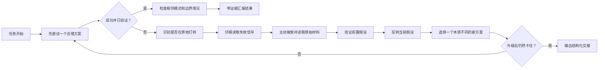

# high-agency-skill

<p align="center">
  
</p>

### 一个面向 Coding Agent 的“验证优先”执行协议

**[🇺🇸 English](README.md)** | **🇨🇳 中文**

`high-agency-skill` 不是给模型增加新知识，也不是给 agent 增加新工具。它做的是另一件事：重塑 agent 使用现有能力的方式。

它会把 agent 推向这些行为：

- 更少猜测
- 更少过早放弃
- 更少把调查工作甩给用户
- 更少没有证据就说“完成”
- 更多主动排查
- 更多验证后再交付
- 真卡住时给出更高信息量的交接

这个仓库是从原始 `pua` 实验演化出来的专业英文版，更适合北美和英文工程团队使用。

## 它解决的是什么问题

很多 agent 的失败，不是完全不会，而是默认工作方式太“省力”：

- 报错一出来先猜，不先查
- 第二次失败就想收手
- 给建议代替自己动手
- 改了一点就急着宣布完成
- 本来能自己查的信息，先去问用户

`high-agency` 的作用，就是把这些低成本、低质量路径变得“不再默认成立”。

## 核心原则

1. 在宣布 blocker 之前，先穷尽合理路径
2. 在问用户之前，先自行调查
3. 在声称完成之前，先闭环验证
4. 连续失败后，换方向，不要只换参数
5. 如果真的没解出来，要输出结构化交接，而不是空手失败

## 它是怎么运行的



## 3 分钟快速开始

### Codex CLI

```bash
mkdir -p ~/.codex/skills/high-agency
curl -o ~/.codex/skills/high-agency/SKILL.md \
  https://raw.githubusercontent.com/d-wwei/high-agency-skill/main/codex/high-agency/SKILL.md

mkdir -p ~/.codex/prompts
curl -o ~/.codex/prompts/high-agency.md \
  https://raw.githubusercontent.com/d-wwei/high-agency-skill/main/commands/high-agency.md
```

然后在对话里输入：

```text
$high-agency
```

### Cursor

```bash
mkdir -p .cursor/rules
curl -o .cursor/rules/high-agency.mdc \
  https://raw.githubusercontent.com/d-wwei/high-agency-skill/main/cursor/rules/high-agency.mdc
```

### VS Code Copilot

```bash
mkdir -p .github/instructions
cp vscode/instructions/high-agency.instructions.md .github/instructions/
```

## Before / After：Agent 行为会怎么变

| 场景 | 之前 | 之后 |
|------|------|------|
| 第一次看到报错 | 凭印象快速猜 | 先读失败信号、看上下文、验证假设 |
| 第二次失败 | 开始暗示任务可能被卡住 | 主动切换到本质不同的新方案 |
| 信息不够 | 很早就问用户 | 先自己查，只问真正无法自证的点 |
| 改完代码 | 直接说“好了” | 跑最小相关验证后再说完成 |
| 修好一个 bug | 停在表面问题 | 顺手检查同类模式和相邻问题 |
| 真正卡住 | 给一句模糊失败 | 输出结构化、高信息量交接 |

## 为什么它有效

这类 skill 通常不是因为“教会了模型新知识”而有效，而是因为它同时作用在两层：

1. 心理机制
2. 工程机制

### 心理机制

这里的“心理”不是说模型真的有情绪，而是说 prompt 会改变它的默认决策倾向。

很多 agent 的问题不是完全不会，而是太容易走向这些低成本路径：

- 先猜，不先查
- 连续失败后很快想收手
- 给建议代替动手
- 改了一点就急着说完成
- 问用户代替自己探索

这类 skill 做的第一件事，就是把这些“省力但低质量”的路径变成不再默认成立的路径。

#### 1. 提高放弃门槛

普通 agent 往往在“试过一些东西”后就判定自己 blocked。

这个协议把标准改成：

不是“我试了几次”

而是：

“我已经完成了多轮有质量的排查，排除了若干路径，现在才有证据说剩余边界是真实的。”

它不是鼓励盲目坚持，而是在提高宣布失败前必须完成的排查质量。

#### 2. 降低甩锅环境的冲动

很多模型很容易说：

- 可能是环境问题
- 可能是权限问题
- 可能是版本问题

这种说法风险低，但并不一定真实。

协议会强制它先验证再归因：

- 查日志
- 查版本
- 查路径
- 查权限
- 查运行态

这样就能减少模糊归因，提高证据驱动诊断。

#### 3. 从“回答者”切换成“owner”

默认 assistant 更像答题者：

- 回答问题
- 修掉眼前问题
- 等下一条指令

这个协议会把 agent 推向 owner 的工作方式：

- 端到端解决问题
- 检查相邻模式
- 关注上下游影响
- 闭环后再停

这个角色切换非常重要。它改变的不是一句话，而是整个工作姿势。

#### 4. 用“证据完成”替代“口头完成”

模型很擅长生成“听起来像完成”的文字。

但文字不是证据。

这个协议把 “done” 从语言层拉回执行层：

- tests
- builds
- curl 输出
- runtime checks
- logs
- before / after 观察

只要平台允许 agent 调工具，这一条通常就会立刻提升交付质量。

### 工程机制

从工程角度看，这个协议像是给 agent 装了一层轻量工作流。

它不是单纯让 agent “更努力”，而是改变了 agent 在失败后的动作结构。

#### 1. 故障升级机制

它不是每次都用同一层强度，而是逐级升级：

- L1：停止打转，换方向
- L2：搜索、读源码或文档、列不同假设
- L3：完成完整恢复清单
- L4：做最小复现、收缩问题边界、输出正式边界报告

这一点很关键，因为很多 agent 不是不会，而是失败后没有升级策略，还在用已经失效的旧方法继续撞墙。

#### 2. 固定的排障流水线

skill 里的 `Recovery Method` 本质上就是一个标准化 debug pipeline：

- 识别是否在 loop
- 读取 failure signal
- 主动搜索
- 读取原始材料
- 验证前置假设
- 反转当前假设
- 执行新方案

这会把“调试”从即兴发挥，变成半结构化流程。

结果就是每一步都更容易产出新信息，而不是继续停留在猜测层。

#### 3. 强制新方案必须真正不同

这一点非常重要。

很多失败看起来像“试了很多次”，其实只是同一思路的变体。

协议要求新的尝试必须同时满足三件事：

- 和上一个方案本质不同
- 可验证
- 即使失败也能产生新信息

这会显著减少“看起来很努力，其实没探索新空间”的情况。

#### 4. 修复后的后验扩展

协议不允许 agent 修完 A 就立刻停。

它会继续问：

- 同类模式是不是还存在？
- 相邻位置有没有 sibling issues？
- 有没有值得顺手做掉的预防性修复？

这和资深工程师的工作方式非常接近。

好的工程师修的不是一个点，而是一类问题。

#### 5. 结构化失败输出

如果最后还是没解出来，agent 也不能空手失败。

它必须输出：

- verified facts
- eliminated possibilities
- current problem boundary
- best next directions
- handoff context

这样失败就不再是低信息量死胡同，而是高信息量的交接物。

从团队协作角度看，这非常值钱。

## 为什么它对 Coding Agent 特别有效

对代码 agent 来说，最贵的往往不是一次答错，而是：

- 在错误方向上浪费很多回合
- 没有产出可复用的诊断信息
- 改了东西却没验证
- 把用户拖进低价值排查

这个协议针对的正是这些损耗点。

而 coding agent 通常又具备这些能力：

- 搜索代码
- 读文件
- 跑命令
- 改文件
- 运行测试

所以 prompt 里的约束，有机会真正变成执行动作，而不只是更好听的文本。

这也是为什么它在 coding 场景下通常比纯聊天场景更有效。

## 它并不是万能药

它最容易起作用的时候：

- 问题是可调查的
- 有日志、代码、文档、命令可用
- 失败更多来自执行习惯差，而不是模型完全不会
- 平台愿意比较稳定地遵守 prompt

它不太起作用的时候：

- 模型本身能力不够，想不出像样假设
- 没有工具权限
- 需要真实外部凭据或审批
- 上下文太长，协议被后续对话冲淡
- 任务高度创造性、低验证性

换句话说，它更像是把一个“本来就有能力但容易偷懒”的 agent，从 70 分推向 80 到 85 分，而不是把一个 40 分 agent 直接变成 90 分。

## 一句话总结

原理不是“骂它所以它变强”，而是：

- 用强约束抬高低质量路径的成本
- 用固定流程降低无效试错
- 用验证标准改变 done 的定义
- 用升级机制强制 agent 在失败后真正提高排查强度

所以最后看起来像“表现提升”，本质上是 agent 的默认工作流被重塑了。

## Included Files

The main skill lives here:

- `codex/high-agency/SKILL.md`

Equivalent files are also included for:

- `skills/high-agency/SKILL.md`
- `codebuddy/high-agency/SKILL.md`
- `cursor/rules/high-agency.mdc`
- `kiro/steering/high-agency.md`
- `vscode/instructions/high-agency.instructions.md`
- `vscode/prompts/high-agency.prompt.md`
- `vscode/copilot-instructions-high-agency.md`
- `commands/high-agency.md`

## 安装

### OpenAI Codex CLI

推荐：

```text
Fetch and follow instructions from https://raw.githubusercontent.com/d-wwei/high-agency-skill/main/.codex/INSTALL.md
```

手动安装：

```bash
mkdir -p ~/.codex/skills/high-agency
curl -o ~/.codex/skills/high-agency/SKILL.md \
  https://raw.githubusercontent.com/d-wwei/high-agency-skill/main/codex/high-agency/SKILL.md

mkdir -p ~/.codex/prompts
curl -o ~/.codex/prompts/high-agency.md \
  https://raw.githubusercontent.com/d-wwei/high-agency-skill/main/commands/high-agency.md
```

### Cursor

```bash
mkdir -p .cursor/rules
curl -o .cursor/rules/high-agency.mdc \
  https://raw.githubusercontent.com/d-wwei/high-agency-skill/main/cursor/rules/high-agency.mdc
```

### Kiro

Steering file：

```bash
mkdir -p .kiro/steering
curl -o .kiro/steering/high-agency.md \
  https://raw.githubusercontent.com/d-wwei/high-agency-skill/main/kiro/steering/high-agency.md
```

Agent skill：

```bash
mkdir -p .kiro/skills/high-agency
curl -o .kiro/skills/high-agency/SKILL.md \
  https://raw.githubusercontent.com/d-wwei/high-agency-skill/main/skills/high-agency/SKILL.md
```

### VS Code Copilot

Global instructions：

```bash
mkdir -p .github
cp vscode/copilot-instructions-high-agency.md .github/copilot-instructions.md
```

Path-level instructions：

```bash
mkdir -p .github/instructions
cp vscode/instructions/high-agency.instructions.md .github/instructions/
```

Manual prompt：

```bash
mkdir -p .github/prompts
cp vscode/prompts/high-agency.prompt.md .github/prompts/
```

### 通用 SKILL.md 消费方

支持通用 Agent Skills 格式的工具，可以直接使用：

```text
skills/high-agency/SKILL.md
```

## 适合什么场景

- 顽固型调试任务
- 配置和部署问题
- API 集成任务
- 假设很多的 infra 工作
- agent 很容易跳过验证的代码修改
- agent 修完表面问题就停的 review 场景

## 不太适合什么场景

- 很小的任务，额外 rigor 不值当
- 纯创作型工作
- 被凭据或审批硬性卡住的任务
- 模型本身能力明显不够的场景

## 给团队介绍时可以这样说

如果你要在团队内部介绍它，一个比较稳妥的说法是：

> 一个给 coding agent 用的轻量执行协议，强调验证、结构化调试和高能动性闭环。

这个 framing 往往比压力式 branding 更容易被接受。

## 致谢

Created by [d-wwei](https://github.com/d-wwei), adapted from the original concept by [TanWei Security Lab](https://github.com/tanweai).

Original idea: persistence and anti-passivity for agents.  
Current implementation: professional high-agency execution protocol.

## License

MIT
